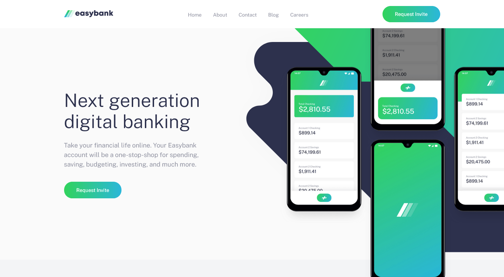

# Frontend Mentor - Easybank landing page solution

This is a solution to the [Easybank landing page challenge on Frontend Mentor](https://www.frontendmentor.io/challenges/easybank-landing-page-WaUhkoDN). Frontend Mentor challenges help you improve your coding skills by building realistic projects. 

## Table of contents

- [Overview](#overview)
  - [The challenge](#the-challenge)
  - [Screenshot](#screenshot)
  - [Links](#links)
- [My process](#my-process)
  - [Built with](#built-with)
  - [What I learned](#what-i-learned)
  - [Continued development](#continued-development)
  - [Useful resources](#useful-resources)
- [Author](#author)


## Overview

### The challenge

Users should be able to:

- View the optimal layout for the site depending on their device's screen size
- See hover states for all interactive elements on the page

### Screenshot



### Links

- [Solution URL](https://www.frontendmentor.io/challenges/easybank-landing-page-WaUhkoDN/hub/easybank-landing-page-0pC5N4I2yx)
- [Live Site URL](https://agbortoko.github.io/easybank-landing-page-master/)

## My process

### Built with

- Semantic HTML5 markup
- CSS custom properties
- Flexbox
- CSS Grid
- Mobile-first workflow
- [SASS](https://sass-lang.com/documentation/) - Sass StyleSheet language
- Vanilla JS

### What I learned

I learned how to make use of the SASS stylesheet language in a real time project. And also how to make proper use of the CSS grid, and CSS flexbox properties in an actual website design proces.

I learned about seperation of concerns in SASS, placing styles of similar intent in thesame sass file.

I also learned how to implement animations in a website design, as seen in the sass snippet below


```sass
.has-fade{
    visibility: hidden;
}

@keyframes fadeIn {
    from{
        visibility: hidden;
        opacity: 0;
    }

    1%{
        visibility: visible;
        opacity: 0;
    }

    to{ 
        visibility: visible;
        opacity: 1;
    }
}

.fade-in{
    animation: fadeIn 200ms ease-in-out forwards;
}


@keyframes fadeOut {
    from{
        visibility: visible;
        opacity: 1;
    }

    99%{
        visibility: visible;
        opacity: 0;
    }

    to{ 
        visibility: hidden;
        opacity: 0;
    }
}

.fade-out{
    animation: fadeOut 300ms ease-in-out forwards;
}
```

Appart from SASS, i learned how to use JavaScript to affect or implement a mobile navigation with an overlay as seen in the snippet below

```js
const mobileBtn = document.querySelector("#mobileBtn");
const header = document.querySelector(".header");
const body = document.querySelector("body");
const fadeElements = document.querySelectorAll(".has-fade");

mobileBtn.addEventListener('click', function(){

    if(header.classList.contains('open')){
        body.classList.remove('no-scroll');
        header.classList.remove('open'); //close mobile menu

        fadeElements.forEach(function(element){
            element.classList.remove('fade-in');
            element.classList.add('fade-out');
        });

    }else{ // open mobile menu
        body.classList.add('no-scroll');
        header.classList.add('open');

        fadeElements.forEach(function(element){
            element.classList.remove('fade-out');
            element.classList.add('fade-in');
        });
    }
  
});


```

I also learned about the CSS positioning properties.

For more information about SASS, i'll recommend the official SASS documentation  [SASS documentation](https://sass-lang.com/documentation/) to learn more.


### Continued development

In my future projects, i'll continue focusing on the use of sass in modern website designs and also how to make use of javascript in different areas of my design.

### Useful resources

- [CSS Tricks CSS grid](https://css-tricks.com/snippets/css/complete-guide-grid/) - This helped me Understand a little more about the CSS grid property
- [CSS Tricks Animations](https://css-tricks.com/almanac/properties/a/animation/) - I was able to understand more about animations by checking our this content.


## Author

- Website - [Add your name here](https://easythz.com)
- Frontend Mentor - [@agbortoko](https://www.frontendmentor.io/profile/agbortoko)
- Twitter - [@agbortoko_arrey](https://www.twitter.com/agbortoko_arrey)

